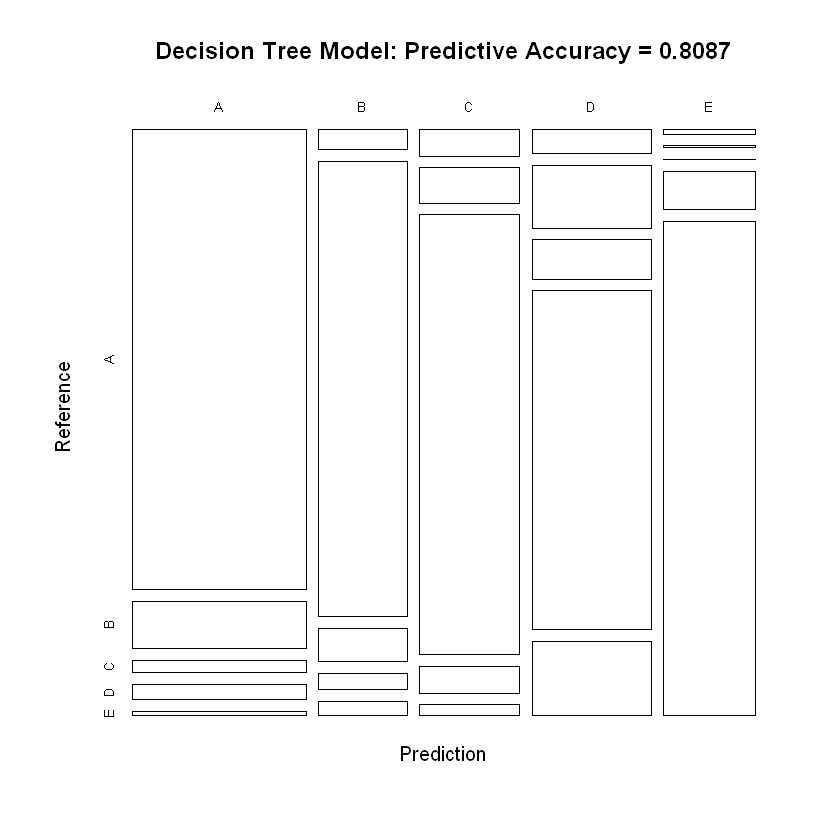

```R
library(lattice)
library(ggplot2)
library(caret)
library(rpart)
library(rpart.plot)
library(corrplot)

library(randomForest)
library(RColorBrewer)
#install.packages("rattle")
require(rattle)
```


```R

training <- read.csv(url(UrlTrain))
testing  <- read.csv(url(UrlTest))

# create a partition with the training dataset 
inTrain  <- createDataPartition(training$classe, p=0.7, list=FALSE)
TrainSet <- training[inTrain, ]
TestSet  <- training[-inTrain, ]
dim(TrainSet)
dim(TestSet)
```


<ol class=list-inline>
	<li>13737</li>
	<li>160</li>
</ol>


<ol class=list-inline>
	<li>5885</li>
	<li>160</li>
</ol>


```R

# remove variables with Nearly Zero Variance
NZV <- nearZeroVar(TrainSet)
TrainSet <- TrainSet[, -NZV]
TestSet  <- TestSet[, -NZV]
dim(TrainSet)
dim(TestSet)
```


<ol class=list-inline>
	<li>13737</li>
	<li>104</li>
</ol>


<ol class=list-inline>
	<li>5885</li>
	<li>104</li>
</ol>


```R

# remove variables that are mostly NA
AllNA    <- sapply(TrainSet, function(x) mean(is.na(x))) > 0.95
TrainSet <- TrainSet[, AllNA==FALSE]
TestSet  <- TestSet[, AllNA==FALSE]
dim(TrainSet)
dim(TestSet)
```


<ol class=list-inline>
	<li>13737</li>
	<li>59</li>
</ol>


<ol class=list-inline>
	<li>5885</li>
	<li>59</li>
</ol>


```R
# remove identification only variables (columns 1 to 5)
TrainSet <- TrainSet[, -(1:5)]
TestSet  <- TestSet[, -(1:5)]
dim(TrainSet)
dim(TestSet)

```


<ol class=list-inline>
	<li>13737</li>
	<li>54</li>
</ol>


<ol class=list-inline>
	<li>5885</li>
	<li>54</li>
</ol>


#### correlation analysis between the variables 


```R

corMatrix <- cor(TrainSet[, -54])
corrplot(corMatrix, order = "FPC", method = "color", type = "lower", tl.cex = 0.8, tl.col = rgb(0, 0, 0))
         
```


    

    


```R
    
# model fit
set.seed(12345)
controlRF <- trainControl(method="cv", number=3, verboseIter=FALSE)
modFitRandForest <- train(classe ~ ., data=TrainSet, method="rf",trControl=controlRF)
modFitRandForest$finalModel

```


    
    Call:
     randomForest(x = x, y = y, mtry = param$mtry) 
                   Type of random forest: classification
                         Number of trees: 500
    No. of variables tried at each split: 27
    
            OOB estimate of  error rate: 0.23%
    Confusion matrix:
         A    B    C    D    E  class.error
    A 3905    0    0    0    1 0.0002560164
    B    8 2647    2    1    0 0.0041384500
    C    0    5 2390    1    0 0.0025041736
    D    0    1    7 2243    1 0.0039964476
    E    0    1    0    3 2521 0.0015841584


```R
 predictRf <- predict(modFitRandForest, TestSet)
```


```R
all_zero_colnames <- sapply(names(TrainSet), function(x) all(is.na(TrainSet[,x])==TRUE))
nznames <- names(all_zero_colnames)[all_zero_colnames==FALSE]
nznames <- nznames[-(1:7)]
nznames <- nznames[1:(length(nznames)-1)] 
nznames
```


<ol class=list-inline>
	<li>'gyros_belt_z'</li>
	<li>'accel_belt_x'</li>
	<li>'accel_belt_y'</li>
	<li>'accel_belt_z'</li>
	<li>'magnet_belt_x'</li>
	<li>'magnet_belt_y'</li>
	<li>'magnet_belt_z'</li>
	<li>'roll_arm'</li>
	<li>'pitch_arm'</li>
	<li>'yaw_arm'</li>
	<li>'total_accel_arm'</li>
	<li>'gyros_arm_x'</li>
	<li>'gyros_arm_y'</li>
	<li>'gyros_arm_z'</li>
	<li>'accel_arm_x'</li>
	<li>'accel_arm_y'</li>
	<li>'accel_arm_z'</li>
	<li>'magnet_arm_x'</li>
	<li>'magnet_arm_y'</li>
	<li>'magnet_arm_z'</li>
	<li>'roll_dumbbell'</li>
	<li>'pitch_dumbbell'</li>
	<li>'yaw_dumbbell'</li>
	<li>'total_accel_dumbbell'</li>
	<li>'gyros_dumbbell_x'</li>
	<li>'gyros_dumbbell_y'</li>
	<li>'gyros_dumbbell_z'</li>
	<li>'accel_dumbbell_x'</li>
	<li>'accel_dumbbell_y'</li>
	<li>'accel_dumbbell_z'</li>
	<li>'magnet_dumbbell_x'</li>
	<li>'magnet_dumbbell_y'</li>
	<li>'magnet_dumbbell_z'</li>
	<li>'roll_forearm'</li>
	<li>'pitch_forearm'</li>
	<li>'yaw_forearm'</li>
	<li>'total_accel_forearm'</li>
	<li>'gyros_forearm_x'</li>
	<li>'gyros_forearm_y'</li>
	<li>'gyros_forearm_z'</li>
	<li>'accel_forearm_x'</li>
	<li>'accel_forearm_y'</li>
	<li>'accel_forearm_z'</li>
	<li>'magnet_forearm_x'</li>
	<li>'magnet_forearm_y'</li>
	<li>'magnet_forearm_z'</li>
</ol>


#### Decision Tree Model 


```R
set.seed(12345)
decisionTreeMod <- rpart(classe ~ ., data=TrainSet, method="class")
fancyRpartPlot(decisionTreeMod)
```

    Warning message:
    "labs do not fit even at cex 0.15, there may be some overplotting"


    

    


```R
predict_decision_tree <- predict(decisionTreeMod, newdata = TrainSet, type="class")
conf_matrix_decision_tree <- confusionMatrix(predict_decision_tree, TrainSet$classe)
conf_matrix_decision_tree
```


    Confusion Matrix and Statistics
    
              Reference
    Prediction    A    B    C    D    E
             A 3558  366  100  117   28
             B   81 1795  130   65   54
             C  119  157 1956  119   46
             D  129  332  209 1795  392
             E   19    8    1  156 2005
    
    Overall Statistics
                                             
                   Accuracy : 0.8087         
                     95% CI : (0.802, 0.8152)
        No Information Rate : 0.2843         
        P-Value [Acc > NIR] : < 2.2e-16      
                                             
                      Kappa : 0.7578         
                                             
     Mcnemar's Test P-Value : < 2.2e-16      
    
    Statistics by Class:
    
                         Class: A Class: B Class: C Class: D Class: E
    Sensitivity            0.9109   0.6753   0.8164   0.7971   0.7941
    Specificity            0.9378   0.9702   0.9611   0.9075   0.9836
    Pos Pred Value         0.8534   0.8447   0.8160   0.6283   0.9159
    Neg Pred Value         0.9636   0.9257   0.9612   0.9580   0.9550
    Prevalence             0.2843   0.1935   0.1744   0.1639   0.1838
    Detection Rate         0.2590   0.1307   0.1424   0.1307   0.1460
    Detection Prevalence   0.3035   0.1547   0.1745   0.2080   0.1594
    Balanced Accuracy      0.9244   0.8228   0.8887   0.8523   0.8888


```R
plot(conf_matrix_decision_tree$table, col = conf_matrix_decision_tree$byClass, 
     main = paste("Decision Tree Model: Predictive Accuracy =",
                  round(conf_matrix_decision_tree$overall['Accuracy'], 4)))
```


    

    


#### Generalized Boosted Model


```R
set.seed(1813)
ctrl_GBM <- trainControl(method = "repeatedcv", number = 5, repeats = 2)
fit_GBM  <- train(classe ~ ., data = TrainSet, method = "gbm",
                  trControl = ctrl_GBM, verbose = FALSE)
fit_GBM$finalModel
```


    A gradient boosted model with multinomial loss function.
    150 iterations were performed.
    There were 53 predictors of which 53 had non-zero influence.


```R
predict_GBM <- predict(fit_GBM, newdata = TrainSet)
conf_matrix_GBM <- confusionMatrix(predict_GBM, TrainSet$classe)
conf_matrix_GBM
```


    Confusion Matrix and Statistics
    
              Reference
    Prediction    A    B    C    D    E
             A 3902   21    0    0    0
             B    4 2621   16    6    5
             C    0   14 2377   19    2
             D    0    2    2 2227   11
             E    0    0    1    0 2507
    
    Overall Statistics
                                              
                   Accuracy : 0.9925          
                     95% CI : (0.9909, 0.9939)
        No Information Rate : 0.2843          
        P-Value [Acc > NIR] : < 2.2e-16       
                                              
                      Kappa : 0.9905          
                                              
     Mcnemar's Test P-Value : NA              
    
    Statistics by Class:
    
                         Class: A Class: B Class: C Class: D Class: E
    Sensitivity            0.9990   0.9861   0.9921   0.9889   0.9929
    Specificity            0.9979   0.9972   0.9969   0.9987   0.9999
    Pos Pred Value         0.9946   0.9883   0.9855   0.9933   0.9996
    Neg Pred Value         0.9996   0.9967   0.9983   0.9978   0.9984
    Prevalence             0.2843   0.1935   0.1744   0.1639   0.1838
    Detection Rate         0.2841   0.1908   0.1730   0.1621   0.1825
    Detection Prevalence   0.2856   0.1931   0.1756   0.1632   0.1826
    Balanced Accuracy      0.9984   0.9916   0.9945   0.9938   0.9964


#### Random Forest Model


```R
set.seed(1813)
ctrl_RF <- trainControl(method = "repeatedcv", number = 5, repeats = 2)
fit_RF  <- train(classe ~ ., data = TrainSet, method = "rf",
                  trControl = ctrl_RF, verbose = FALSE)
fit_RF$finalModel
```


    
    Call:
     randomForest(x = x, y = y, mtry = param$mtry, verbose = FALSE) 
                   Type of random forest: classification
                         Number of trees: 500
    No. of variables tried at each split: 27
    
            OOB estimate of  error rate: 0.24%
    Confusion matrix:
         A    B    C    D    E  class.error
    A 3905    0    0    0    1 0.0002560164
    B    9 2644    4    1    0 0.0052671181
    C    0    6 2389    1    0 0.0029215359
    D    0    0    6 2245    1 0.0031083481
    E    0    1    0    3 2521 0.0015841584


```R
predict_RF <- predict(fit_RF, newdata = TrainSet)
conf_matrix_RF <- confusionMatrix(predict_RF, TrainSet$classe)
conf_matrix_RF
```


    Confusion Matrix and Statistics
    
              Reference
    Prediction    A    B    C    D    E
             A 3906    0    0    0    0
             B    0 2658    0    0    0
             C    0    0 2396    0    0
             D    0    0    0 2252    0
             E    0    0    0    0 2525
    
    Overall Statistics
                                         
                   Accuracy : 1          
                     95% CI : (0.9997, 1)
        No Information Rate : 0.2843     
        P-Value [Acc > NIR] : < 2.2e-16  
                                         
                      Kappa : 1          
                                         
     Mcnemar's Test P-Value : NA         
    
    Statistics by Class:
    
                         Class: A Class: B Class: C Class: D Class: E
    Sensitivity            1.0000   1.0000   1.0000   1.0000   1.0000
    Specificity            1.0000   1.0000   1.0000   1.0000   1.0000
    Pos Pred Value         1.0000   1.0000   1.0000   1.0000   1.0000
    Neg Pred Value         1.0000   1.0000   1.0000   1.0000   1.0000
    Prevalence             0.2843   0.1935   0.1744   0.1639   0.1838
    Detection Rate         0.2843   0.1935   0.1744   0.1639   0.1838
    Detection Prevalence   0.2843   0.1935   0.1744   0.1639   0.1838
    Balanced Accuracy      1.0000   1.0000   1.0000   1.0000   1.0000


#### The predictive accuracy of :
###### Decision Tree Model: 80.87 %
###### Generalized Boosted Model: 99.25 %
###### Random Forest Model: 100 %


```R

```
